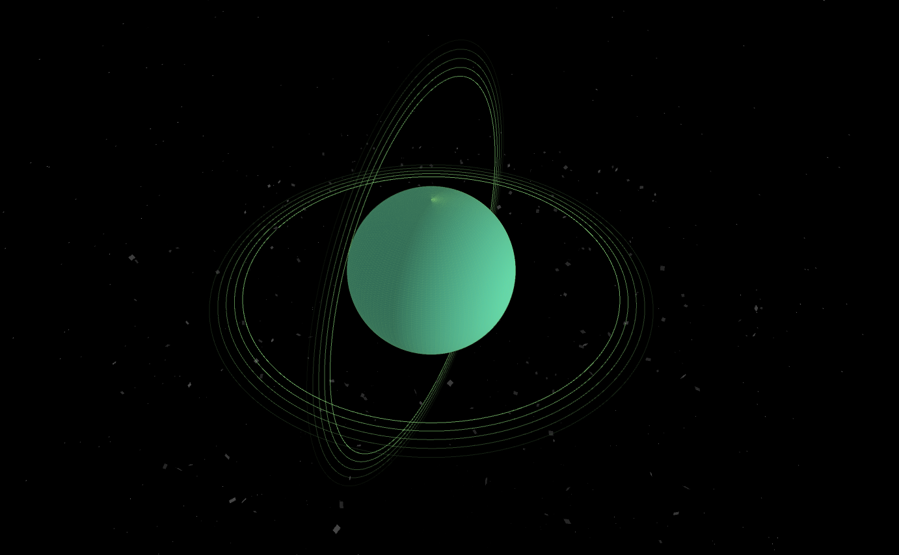
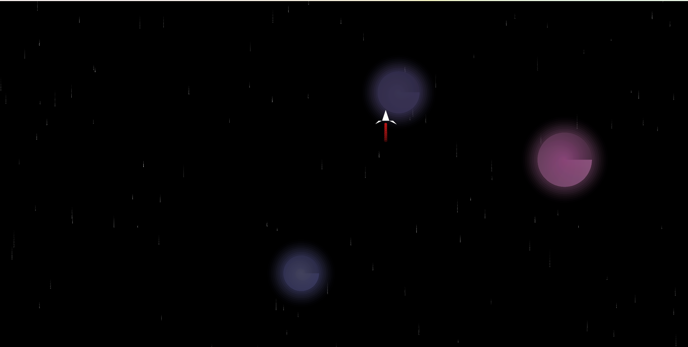
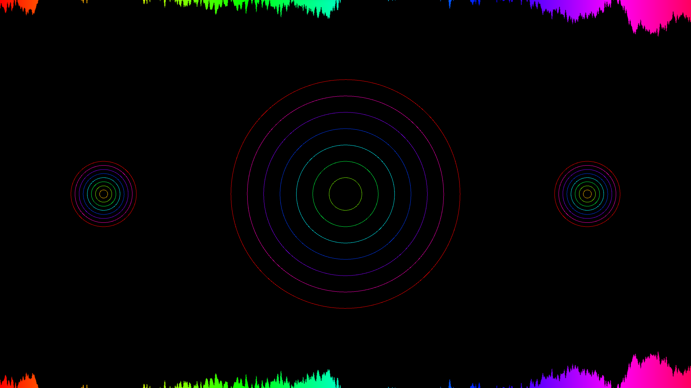
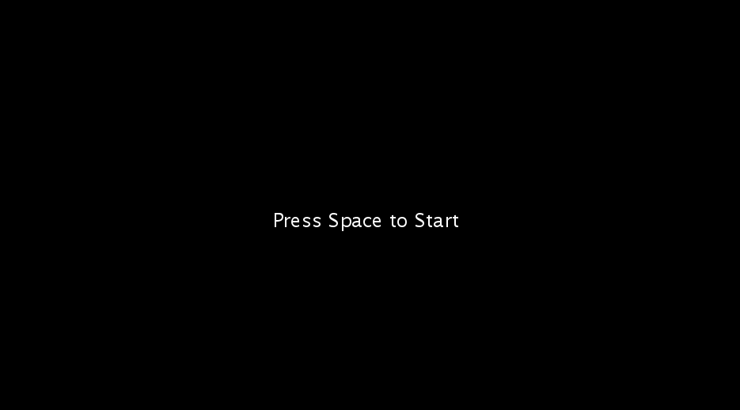

# Music Visualiser Project

Name - Student Number:

Ivan Zenin - C21406436

Eric O'Brien - C21750829

Yasser Alshimmary - D21127124

Daniel Phillips - C20421994

# Description of the assignment

Music: Vampire Hearts/Cant Lie Slowed - https://www.youtube.com/watch?v=q5s0vCQ30SA&ab_channel=Enjoyer.

OOPProject Video:

## Ivan's Work
I worked on Planet.java in the project. The program displays a 3D scene containing a pulsing planet, rotating stars, and shockwaves that reacts to the audio input. The program includes several other methods for drawing the objects in the scene, such as drawPlanet(), drawStars(), drawAsteroid(), and drawShockwaves(). These methods utilize the Processing API to create 3D shapes, apply transformations, and set colors based on the audio input and elapsed time. The createStarsTexture() and createStarsSphere() methods generate the texture and shape for the starry sphere. The initializeStars() method populates the star arrays with random values, calculating initial positions for the stars.

### How it works
1. The class Planet extends the Visual class and initializes variables related to the planet, stars, shockwaves, and scenes.
1. In the settings() method, the sketch size and renderer are defined.
1. The setup() method initializes the color mode, starts the Minim library, loads the audio file, and sets up the rocket, stars, and starry sphere.
1. The initializeStars() method populates the star arrays with random values and calculates initial positions for the stars.
1. The drawPlanet() method calculates the pulsing size based on smoothed bass, sets the planet color, and draws the planet.
1. The drawStars() method updates star positions and draws the stars.
1. The drawAsteroid() method draws the asteroid shape.
1. The createStarsTexture() method generates a random star texture.
1. The createStarsSphere() method creates a sphere with the star texture.
1. The drawStarryBackground() method draws the starry sphere in the background.
1. The drawShockwaves() method calculates the shockwave color, radius, and alpha, and draws the shockwaves around the planet.

### What I am most proud of in the assignment
Im most proud of the ability of all the methods working together to make such a unique visualization. The end result turned out better than I expected and it was intreseting to learn about the different ways of creating 3D shapes. My favourite method would probably be the asteroids circling around the planet as I believe they appear visually impressive. 

## Eric's Work
I worked on the Rocket.java in the project. My inspiration for this idea was old 2d space astroid games, I really want to convey the idea of being on a solo space exploration into deep space. A rocket is shown orbiting the screen's center in a 2D visual simulation made by this application, with stars and planets in the backdrop. The planets have a shimmering halo, while the rocket has a trail of engine fire. There are implemented distinct classes for the rocket, RocketStars, and RocketPlanets, each with their unique set of characteristics. All of the objects on the canvas are updated and displayed by the main drawing loop. Overall the program uses a combination of translation and rotation to create the orbiting effect of the rocket, and employs various drawing techniques to create the visual elements, such as the planet's surface shading and the rocket's engine trail.

### How it works
1) A Rocket class is defined, which extends the Visual class.
2) RocketStar and RocketPlanet inner classes are defined within the Rocket class, representing stars and planets.
3) The main drawing loop (draw method) updates and displays all objects (stars, planets, and rocket) on the canvas.
4) The drawStars method creates stars with random positions and speeds.
5) The createRandomPlanets method generates planets with random positions, sizes, colors, and speeds.
6) The drawRocketPlanet method draws the planet and its glowing aura.
7) The drawRocket method renders the rocket and its engine trail.

### What I am most proud of in the assignment
I'm mainly proud of the rocketship with the thruster behind it pulsating. It was a difficult but enjoyable experience but I was delighted how it turned out. It gave me a nostalgic feeling of a pixel art style ship. I'm also really proud of the teamwork that was done here and how all of our ideas came as one.

## Daniel's Work
I worked on the pulseStar.java class for our project. My idea was to create multiple planet (star) shaped objects that pulse to the music. I also wanted to have a waveform on the top and bottom of the screen that did the same. The class contains code to create lerpedBuffer variable and a smoothamplitude variable that make the waveform and circles behave less erratically. There is a loop to draw the waveforms and a loop to draw the circles.

### How it works
1) pulseStar class is defined. It extends Visual class.
2) draw() function is called from Planet class switch statement.
3) lerpedBuffer array is created to allow smoother waveform.
4) smoothAmplitude variable is created to allow smoother circle expansion and compression.
5) A loop creates the waveforms at the top and bottom of screen.
6) Another loop creates three pulsing circular formations with the middle being the largest.

### What I am most proud of in the assignment
I am most proud of how my scene turned after struggling to figure it all out. My idea to do pulsing stars turned into me creating 3 circle formations that look like the base of speaker reacting to music. 

## Yasser's Work
In the beginning, I start work on a scene to add it to our project, after that we face a problem, how can we switch between scenes, the planet scenes and rocket scenes. The goal was to allow users to transition between two classes, Rocket class and planet class, while the song is playing. The planet class is updated by add two function pressed function to use buttons to change between scene and add switch statement to make switch between scenes. also add Rocket object for the rocket scene. And update all functions in class to accept PApplet as parameter. The Rocket class updated to accept a 'PApplet' object as a parameter and updated all function in class to accept PApplet as parameter. 

### How it works
1. Add pressed function, to start the project by pressed shift, and switch between class. 
1. Add switch statement to switch between scenes.
1. Update Visual class by add PApplet parent.

1. Update Planet class:
- Add Rocket object for the rocket scene.
- Update parameters in both drawShockwaves()  and draw() to accept 	PApplet.

5. Update Rocket:
- Add PApplet project
- Add Rocket  Constructor to accept PApplet parent
- update display(), draw(), drawStars(), and drawRocket() 		functions to accept PApplet parent, also update parameters in each 		functions

### What I am most proud of in the assignment
The good team work, especially when we had some major setbacks and how we worked though issues. Happy with the end result.

# Instructions
